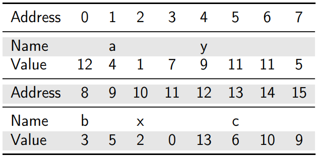

# Pointer (Important!)

## 1 - Memory

### 1.1 - Memory Components
Memory - used to store programs when they are executing and store their data.

When your computer run multiple programs at the same time, all of them need to access to the memory (this process is controlled by the operating system). 

The memory assigned to C is divided into three parts:
1. Static Memory
2. Heap Memory
3. Stack Memory

### 1.2 - Static Memory
Definiton: the memory that does not change in size.

When the computing firstly executes a program, it will create the necessay memory, being kept until the program is finished. Static memory contains:
1. The instructions of the program.
2. The global variables that we have defined.

### 1.3 - Heap Memory
Compared to static memory, heap memory is for dynamically allocated sections of memory. Unlike static memory created automatically for us, to get memory from the heap, the programmer must request it from the operating system. Also, we're responsible to release it back to the operating system because if we do not do that, more and more used memory will slow down our computer or maybe even creash it. This is the famous **memory leak**.

### 1.4 - Dynamic Memory Allocation
Definition: the process of getting memory from the heap is known as dynamic memory allocation. 

This process gives us a pointer to allow us to access the memory. 

### 1.5 - Stack Memory
We usually just call stack memory as **stack**. The stack is where local variables and parameters are remembered (and don't forget global variables are remembered in static memory). The stack is made up of different parts that are allocated and released automatically for us when our program is running. These parts are called **stack frames**.

### 1.6 - Stack Frames
Whenever a funciton is called, a stack frame is created to hold any local variables and parameters. When the function is finished, this stack frame is removed from the stack, and we cannot access any variable contained in it.

## 2 - The Stack (not the same to stack memory)

### 2.1 - What is Stack?
Stack is a type of data structure working on the principle of last in first out (LIFO), which means we can **only** access the element on the top.
### 2.2 - The Stack in Memory
The stack in memory works on the same principle of LIFO: when a function is called, a new frame (holding all of the function's variables and parameters) is created and placed on the top of the stack holding. We have no longer have access to local variables of any other functions.

### 2.3 - Benefits of Using a Stack
- It frees programmers from caring about allocating memory or freeing it when we finished.
- As this is the only frame that can be accessed while the function is executing, variables in different functions with cannot be confused.

## 3 - Representing Memory
Every variables we create is stored somewhere in memory. Knowing if it is static, heap or stack tells us our responsibilities, but all of these parts are just stored in the main memory of the computer, which is like a really big array.

### 3.1 - Memory Cells
The memory of our computer is made up of many memory cells. Each memory cell can typically store 8 bits of data (some values require multiple cells). Each cell has an address we can use to access it (just like the index in an array).

### 3.2 - Address, Variable Name, & Value
- Each memory cell stores 8 bits of data (value).
- Each memory cell has an unique address to access to it. 
- By declaring a name for a variable, we can use the name to refer to memory address.
- Therefore, programmers can use variable names to conduct operations to the data inside memory units by referring to their addresses.

### 3.3 - Referencing & Dereferencing
- Referencing: `&` can be used to find the address of a variable.
- Dereferencing: `*` can be used to find the value of an address.

For example, for the imaginary computer below: 
- the value of `&a` is 1.
- the value of `*x` is 1.
- There is a **QUESTION** here, `*x` equals to 1 must satisfy two points:
    1. x must remember the value directly (which means the value is a primitive type data - int)
    2. the type of value of x is the same type to the address type (but they are ususally hexdecimal right?)
    - **Answer**: in C, we need to consider in a relatively low level. It's all about 0s and 1s. The same piece of data (a series of 0s and 1s) will be interpreted differently based on how it is declared and used in C. For example, a sequence of bits might be interpreted as an integer, a floating-point number, a character, or any other data type, depending on how it is declared and what operations are performed on it.

<div align="center">
    
</div>

### 3.4 - Pointers
From the above example, variable `a` remembers a memory address, so it can be called a **pointer** or pointer varible.

# Question
1 - In both java and c, variables directly remember the value of primitive type data. And they both remember the memory address of reference type data like array. 

The difference between java and c lies in that in java, functions are pass by reference, whereas c functions are pass by value, although we can declare a pointer variable as the parameter to let them pass by value.

2 - So every variable storing reference types data can be called a pointer in c right? Because they remember addresses instead of values.

## 4 - Pointers in C

### 4.1 - Memory in Real Computer
In a real computer, memory addresses can be much bigger numbers. For example, in terms of a 32 GB of RAM, its addresses can range between 0 - 34,359,720,774. Generally, memory addresses are written as hexadecimal numbers. If we want to print an address, we need to use the format specifier `%p`:
```C
#include<stdio.h>
int main(){
    int a = 25;
    int *b = &a;
    printf("Value: %d\n", *b);
    printf("Address: %p\n", b);
}
```

### 4.2 - Pointer Variables
Pointers are variables that contain memory addresses.

A pointer can be assigned to point to different varibles during the lifetime of the program.

- When we declare a pointer, we must state the type of data it points to and use an asterisk `*` before the variable name to show that it is a parameter.

- If we use an asterisk beside the name *after* declaration, it will get the value in the address it points to (dereferencing)

### 4.3 - Literal Pointers
We never write literal memory addresses in our programs. This will almost always result in our program crashing.

## 5 - Using Pointers with Functions
### 5.1 - Pass by Value
### 5.2 - Pass by Reference

## 6 - Pointers & Arrays


### 6.1 - Arrays in Memory
When we declare an array we are simply given an amount of memory. The amount of memory is based on the number of elements and the size of each element.


### 6.2 - Arrays are Pointers
- Arrays are just a nicer way of using pointers (a **contiguous** block of memory).
- **The variable that remembers the array is nothing more than a pointer to the start of the array**
- Assume we declare an array such as `int arr[5];`. Here, `arr` is actually a pointer to the first element in the array. When we use the code `arr[2]`, it means that we start from the beginning of the array and go forward two ints to get the third element. It's the same as using the address `arr + (2*4)`.

### 6.3 - Addresses of Indices in an Array
- C uses **pointer arithmetic** to know the addresses of each index in the array
    - which is **based on the size of the data type declared**.
        - For a `char` array, where each `char` is a single byte, the address of each index is 1 higher than the last.
        - For an `int` array, where each `int` is 4 bytes, the address of each index is 4 higher than the last.

### 6.4 - Calculating Array Addresses
As I stated above, the pointer arithmetic is based on the size of the data type we're using. Therefore, for `int` type data, if we want to know the **next address** in the array named `numbers`, we can just add 1*1 to the variable `numbers`: `numbers + 1`. 

Then, we can get the **value** by dereferencing it: `*(numbers + 1)`, which is the same as using the array subscript operator `numbers[1]` (subscript operator is a shortcut).

### 6.5 Pointers to Pointers
It's common to see code declaring a pointer to a pointer to something. 
- **Implicit form**:
    - an array of strings: `char *names[4]`
- **Explicit**:
    - passing a pointer to a function that can be changed: `int **smallest`